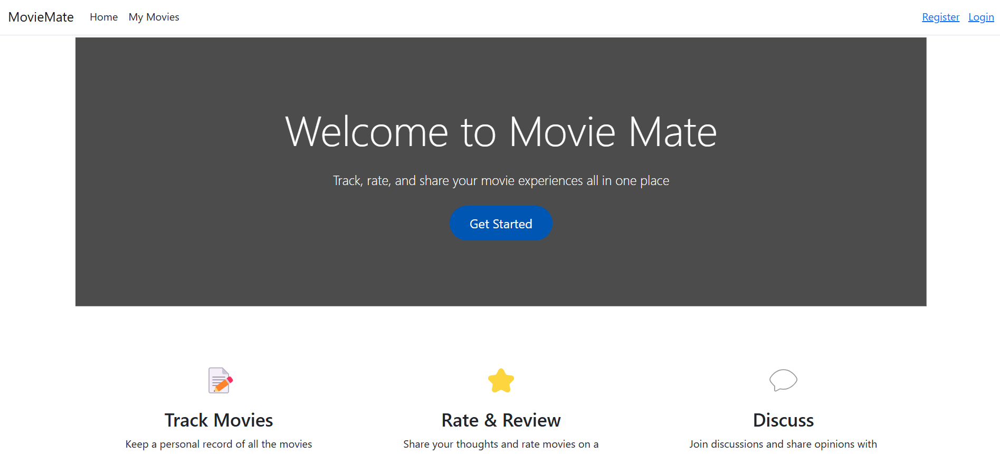

# MovieMate Web Application  
Information Systems Project  

**Author**: Sofía Martínez Pastor  
**Student ID**: 70093905 

---

## Project Description  

**MovieMate Web Application** is a movie catalog built using ASP.NET Core MVC. It allows users to save the movies they've watched and rate them. The web application is part of the larger MovieMate system, which includes both the mobile and web applications.

---

## Features  
- **User Login & Registration**: Users can securely log in or register to access their movie catalog.
- **CRUD Operations**: Users can create, read, update, and delete movies they have watched.
- **Database Integration**: Movie-related information and user data are stored in a Microsoft Azure SQL database.
- **Swagger UI**: The web service is fully documented with Swagger UI, allowing easy testing and interaction with the API.
- **Public Access**: The web application is hosted on Microsoft Azure, providing public access to the system via the url: https://moviemate.azurewebsites.net/

---

## Technologies Used  
- **ASP.NET Core MVC** for the web application framework.
- **Microsoft Azure** for hosting the application and database.
- **SQL Server** for database management.
- **Swagger UI** for API documentation and testing.
- **HTML/CSS** for basic styling and UI design.
---

## Screenshots  

Here are a few screenshots showing the interface of the web application:

1. **Home Page**  

      

      

2. **Login Screen**  
      

2. **Register Screen**  
     

3. **Movie List Screen**  
      

4. **Movie Detail Page**  
      
---

## Database Schema  
The project uses a SQL Server database hosted on Microsoft Azure. The schema includes the following tables:
- **Users**: Stores information about the users of the application.
- **Movies**: Contains details about the movies (title, director, etc.).
- **UserMovies**: Stores the relations movies to users.

The database model can be seen in the diagram below, I created it using SQL Server Management Studio (SSMS):

  

---

### Final Notes  
This project was built as part of an Information Systems course, and the primary goal was to develop a working web application and REST API to manage movies. The current functionality includes full CRUD operations, user authentication, and a basic UI design. Future improvements will focus on enhancing the user experience and adding more advanced features like AI recommendations.
